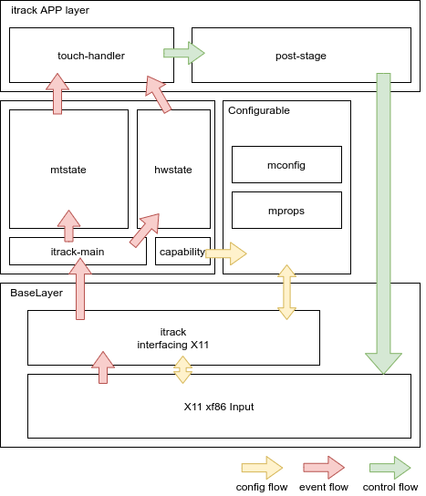

itrack
=======
# Description
itrack is aimed to make linux user who use apple's trackpad(or any other moderm trackpad) have a close experience to macOS.

It is a X11 input module similar to [xf86-input-mtrack](https://github.com/BlueDragonX/xf86-input-mtrack),However itrack is less customizable(current version),it remove some unusall seting that will increate the complexity,but forcus on improving the user experience.

It is reference [xf86-input-mtrack](https://github.com/BlueDragonX/xf86-input-mtrack),the low level X11 interfacing and mtouch intergration module is forked from.But all the upper-layer logic is writen from scratch.

# Compatibility
* [WARNING] It is only test on my own apple-magic-trackpad 2,it should work for all moderm trackpad.
* Test On MD101 macbook pro,2012,it works.

# Feature
    * One finger move
    * Physical button press (with tiny movenent inherbition)
    * 1,2,3 finger tap (map to button 0,2,1)
    * Two finger scroll[natrual is configured]
    * Finger leaves , scroll with inertia.
    * Three finger drag (like macos)

# Todo
    * It is non-configurable,any setting parameter change needs to make a recompile
    * no four finger support now
    * two finger rotate
    * two finger pinch
    * edge ignoring
# Important 
Must add self to input group to have permission to your touchpad

`gpasswd -a USERNAME input`

# Design
Block diagram



Module list(same name with .c)
* itrack: interfacing with X11 Xf86Input module
* itrack-main: itrack lifecycle implement
* capability: detect trackpad patermater (todo)
* mconfig:saving and create configure dict from runtime
* mprops:X11 options setting implement
* mtstate,hwsteate: multitouch state,lowlevel touch event driver
* touch-handler: main logic dispatch touches and create staged status change,it create a staged-status that tells,what itrack want todo
* post-stage:receiving staged-status created from touch-handler,and perform it,it actually performance all mouse move,button touch etc...

`touch-handler` and `post-stage` is where the developer should work hard on 

# Building and Installing
This is a standard autoconf package. So:
```shell
./autogen.sh
make && make install
```
This xorg maybe install in /usr/lib/xorg.if you want to change to somewhere else, checkout `autogen.sh` and edit prefix 

It is likely that you will need to change system-dependent paths such as the xorg module directory.

# Configure
The following is a minimal working InputClass section for xorg.conf:
create a file under `/etc/X11/xorg.conf.d/20-itrack.conf`
```
Section "InputClass"
    MatchIsTouchpad "on"
    Identifier      "Touchpads"
    Driver          "itrack"
EndSection
```
For pointer move configuration on magic trackpad 2,I use following Options,make it close to macos.
```
    Option "ConstantDeceleration" "2.000000"
    Option "AdaptiveDeceleration" "5.00000"
    Option "VelocityScale" "0.2"
    Option "AccelerationProfile" "2"
```

# Debug
I used this way to debug.
* 1,add a new user eg."x11_dev",with x11 permission,and configure him to able to use `startx` cmd start X11 enviroment.
* 2,code ,make ,and install 
* 3,switch to tty2,and login with x11_dev,run `startx -- :1` to start a new X11 instance (X11 debug env)
* 4,retry how trackpad move
* 5,swith to tty1(X11 coding env),goto step 2 until done

## FIFO
A debug fifo(/tmp/itrack_debug_fifo) is created when set `-DDEBUG_FIFO=1`

When touches events happened.Bin data is writen to fifo.

Its format is(64bit):
```
0x0000 int   // stat
0x0008 int   // mask
0x0010 Touch[16] // struct Touch[16]
```

It should be read as struct
```c
struct {
    int stat;
    int mask;
    struct Touch touches[16];
};
```
which struct Touch is
```c

struct Touch {
	bitmask_t flags;
	int tracking_id;
	int x, y, dx, dy;
	int total_dx, total_dy;
	int distance;
	struct timeval create_time;
	struct timeval update_time;
	struct timeval last_update_time;
	int touch_major,touch_minor;
	int ap_major,ap_minor;
};

```
Flasgs is

```c

#define MT_NEW 0
#define MT_RELEASED 1
#define MT_INVALID 2
#define MT_THUMB 3
#define MT_PALM 4
#define MT_EDGE 5
#define MT_TAP 6
#define MT_BUTTON 7

```
